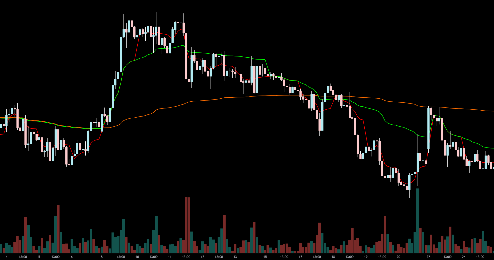

# VWAPs in Daily/Weekly/Monthly sequence (Pine Script v6)

This repository contains a TradingView **Pine Script v6** indicator that plots **anchored VWAPs** that reset on **Daily**, **Weekly**, and **Monthly** boundaries, plus an optional **Rolling VWAP**.

The script uses the classic VWAP formula:

- **VWAP = Σ(price × volume) / Σ(volume)**

It also supports:
- Displaying **historical (frozen) VWAPs** for a configurable number of past daily/weekly/monthly sessions
- Optional **standard deviation bands** (±1σ, ±2σ, ±3σ) around a selected VWAP source
- **Session start markers** and labels for day/week/month changes
- A **timezone offset** input to shift the period boundary detection

## Screenshot

> Put the image file in the repository root as `image.png`.

## Files

- `@version=6 VWAPs DMWRolling.txt` — the Pine Script indicator source (copy/paste into TradingView’s Pine Editor).

## How it works (high level)

1. **Timezone-adjusted boundaries**
   - The script offsets `time` by `Timezone Offset (Hours from UTC)` and derives adjusted day/week/month values.
   - A new session is detected when the adjusted day/week/month changes.

2. **Anchored VWAPs (Daily / Weekly / Monthly)**
   - For each period, the script keeps running sums of `src * volume` and `volume`.
   - On a new period boundary it “freezes” the previous period by storing each bar’s VWAP into an array, so it can be redrawn later as historical lines.

3. **Rolling VWAP (optional)**
   - Calculates VWAP over the last `Rolling Period (Bars)` by looping through bars and summing `src[i] * volume[i]` / `volume[i]`.

4. **Standard deviation bands**
   - Uses `ta.stdev(close, StdDev Period)` and plots bands around the selected VWAP (Daily/Weekly/Monthly/Rolling).

## Usage (TradingView)

1. Open TradingView → **Pine Editor**
2. Copy the contents of `@version=6 VWAPs DMWRolling.txt` into the editor
3. Click **Add to chart**
4. Configure inputs:
   - Enable/disable Daily/Weekly/Monthly VWAP
   - Toggle Rolling VWAP and set its length
   - Choose bands source + which σ bands to show
   - Set history limits for how many past sessions to draw

## Notes / limitations

- **Performance:** drawing many historical sessions creates many `line.new()` objects. If your chart is slow, reduce the history limits.
- **Bands:** bands are based on the standard deviation of `close`, not of VWAP.
- **File extension:** the script is stored as `.txt` in this repo; TradingView expects it pasted into the Pine Editor.
